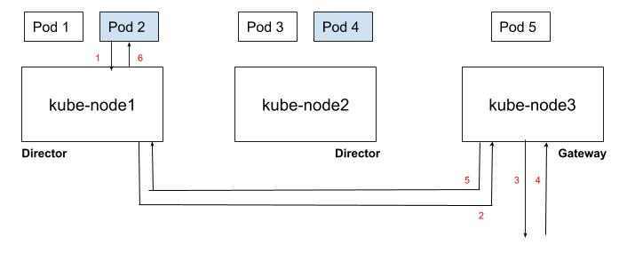

# kube-static-egress-ip

A Kubernetes CRD to manage static egress IP addresses for workloads

***Note: This project is in alpha stage. We are actively working on improving the functionality and incorporating the user feedback. Please see the roadmap. You are welcome to tryout and provide feedback.***

## Overview

### Problem Statement

Kubernetes [Ingress](https://kubernetes.io/docs/concepts/services-networking/ingress/) and [Services](https://kubernetes.io/docs/concepts/services-networking/service/) provide a good solution for exposing services in the cluster to external clients outside of the cluster. With these constructs, you have fine granular control over which workloads (sets of pods) are exposed, how they are exposed, and who can access them. But what about managing traffic in the reverse direction? How can workloads running in the cluster securely access services outside cluster? Through egress network policies we have basic control of which pods can access what services. However, beyond that Kubernetes does not prescribe how egress traffic is handled. And, Kubernetes CNI network [plug-ins](https://kubernetes.io/docs/concepts/extend-kubernetes/compute-storage-net/network-plugins/) provide varying functionalities to handle egress traffic from pods.

One common solution offered across CNIs is to masqurade egress traffic from pods running on a node, to use the node's IP as source IP for outbound traffic. As pod IP's are not necessarily routable from outside the cluster this provides a way for pods to communicate with services outside the cluster. It's not uncommon for most production grade on-premises or cloud deployments to restrict access (i.e. white-list traffic) to services, so that only trusted entities can access the service. This poses a challenge, from a security perspective, for the workloads running in the Kubernetes cluster as there is no predictable egress IP that is used for the outbound traffic from the pods. It is also highly desirable to have fine-grained control on what IP addresses are used for outbound traffic from a workload (set of pods) running on the Kubernetes cluster, as not all workloads in a cluster may be allowed to access the external service.

### Solution

*kube-static-egress-ip* provides a solution with which a cluster operator can define an egress rule where a set of pods whose outbound traffic to a specified destination is always SNAT'ed with a configured static egress IP. *kube-static-egress-ip* provides this functionality in Kubernetes native way using custom rerources.

For e.g. below is a sample definition of a `staticegressip` custom resource defined by *kube-static-egress-ip*. In this example all outbound traffic, from the pods belonging to service `frontend`, to destination IP `4.2.2.2` will be SNAT'ed to use 100.137.146.100 as source IP. So all the traffic from selected pods to 4.2.2.2 is seen as if they are all coming from 100.137.146.100

```yaml
apiVersion: staticegressips.nirmata.io/v1alpha1
kind: StaticEgressIP
metadata:
  name: eip
spec:
  rules:
  - egressip: 100.137.146.100
    service-name: frontend
    cidr: 4.2.2.2/32
```

## Getting Started

### How it works

*kube-static-egress-ip* is run as a daemon-set on the cluster. Each node takes a role of a *director* or a *gateway*. Director nodes redirect traffic from the pods that need static egress IP to one of the nodes in cluster acting as Gateway. A Gateway node is setup to perform SNAT of the traffic from the pods to use configured static egress IP as the source IP. Return traffic is sent back to Director node running the pod. The following diagram depicts life of a packet originating from a pod that needs a static egress IP.

<p align="center">
   </image>
</p>

1. pod 2 sends traffic to a destination.
2. director node (is setup by `kube-static-egress-ip` to redirect) redirects the packets to gateway node if pod 2 is sending traffic to a specific destination
3. node acting as `gateway` recieves the traffic and perform SNAT (with configured egress IP) and sends out the packet to destination
4. node recieves the response packet from the destination
5. node performs DNAT (to pod IP) and forwards the packet to director node
6. director node forwards the traffic to pod

Plese see the [design](./docs/design.md) details to understand in detail how the egress traffic from the pods is sent across the cluster to achive static egress IP functionality.

### Installation

*kube-static-egress-ip* is pretty easy to get started with.

Install the `staticegressip` Custom Resource Definition (CRD) as follows:

```sh
kubectl apply -f https://raw.githubusercontent.com/nirmata/kube-static-egress-ip/master/config/static-egressip-crd.yaml
```

Create necessary RBAC to run the controllers

```sh
kubectl apply -f https://raw.githubusercontent.com/nirmata/kube-static-egress-ip/master/config/static-egressip-rbac.yaml
```

Next you need to install deployment for `static-egressip-gateway-manager` which automatically selects nodes to act as gateway for a `StaticEgressIP` custom resource

```sh
kubectl apply -f https://raw.githubusercontent.com/nirmata/kube-static-egress-ip/master/config/static-egressip-gateway-manager.yaml
```

You shall see the pod running for the deployment created for `static-egressip-gateway-manager`

```
kubectl get pods -o wide -n kube-system -l name=static-egressip-gateway-manager                                                                                                                                                                                                           ❯❯❯
NAME                                              READY     STATUS    RESTARTS   AGE       IP             NODE            NOMINATED NODE   READINESS GATES
static-egressip-gateway-manager-d665565cb-hwrts   1/1       Running   0          25m       10.244.2.208   falnnel-node2   <none>           <none>
static-egressip-gateway-manager-d665565cb-qtnms   1/1       Running   0          25m       10.244.1.187   flannel-node1   <none>           <none>
static-egressip-gateway-manager-d665565cb-xwdgr   1/1       Running   0          25m       10.244.1.186   flannel-node1   <none>           <none>

```

Finally you need to install a daemonset which runs `static-egressip-controller` on each node configures a node to act as director or gateway for a `StaticEgressIP` custom resource.

```sh
kubectl apply -f https://raw.githubusercontent.com/nirmata/kube-static-egress-ip/master/config/static-egressip-controller.yaml
```

You shall see the pods running on each node of the cluster. For e.g.

```
kubectl get pods -o wide -n kube-system -l k8s-app=static-egressip-controller                                                                                                                                                                                                             ❯❯❯
NAME                               READY     STATUS    RESTARTS   AGE       IP              NODE             NOMINATED NODE   READINESS GATES
static-egressip-controller-jbgf5   1/1       Running   0          20m       192.168.1.201   flannel-node1    <none>           <none>
static-egressip-controller-k4w59   1/1       Running   0          20m       192.168.1.200   flannel-master   <none>           <none>
static-egressip-controller-lhn5l   1/1       Running   0          20m       192.168.1.202   falnnel-node2    <none>           <none>

```

At this point you are all set to deploy `staticegressip` objects and see things in action.

### `staticegressip` resources

You can then create a `staticegressip` resource object like any other Kubernetes resource object

```yaml
spec:
  rules:
  - egressip: 100.137.146.100
    service-name: frontend
    cidr: 4.2.2.2/32
```

Spec consists of one or more `rule`'s. Each rule defines the following"
- service-name: kubernetes service whose selected pods are the traffic source
- cidr: the desitination address for the egress traffic from the selected pods
- egressip: IP address to which traffic should be SNAT, hence providing a static egress IP

Please modify provided [example](./config/static-egressip-example.yaml) example manifest as per your setup to try out.

## Goals

- a generic solution that works across popular CNI's like Flannel, Weave, Calico etc
- a scalable solution where the role of Gateway can be spread across more than one node
- a solution that is higly available and resilient to node failures
- fine grained controls to choose the set of pods by namespace, service or general label selectors etc in `staticegressip` resource
- no compromise to egress network policies enforcement
- automatically selection of node Gateway role, via leader election, which does not require manual involvement

## Status

Here is quick status of the project:

- suppports CNI's that support direct routing of pod traffic to other nodes. Flannel host-gw backeend mode, Calico and kube-router can used
- operator has to manually choose a node to act of Gateway by annotating the node
- only a single node acts as a gateway
- no high-availability, if node acting as Gateway dies functionliaty no longer works.
- egress IP's specified in the `staticegressip`are expected to be routable to the node acting as Gateway in the cluster
- supports selection of pods selected by provided Kubernetes service name. 

## Roadmap

- support CNI's that provide overlay solution like Flannel with vxlan backend, Weave etc
- support leader election among the nodes so that operator does not have to choose and configure a node a Gateway
- support more than a single node to act as Gateway
- when a node acting as Gateway dies, reconfigure so that a new node performs Gateway functionliaty.
